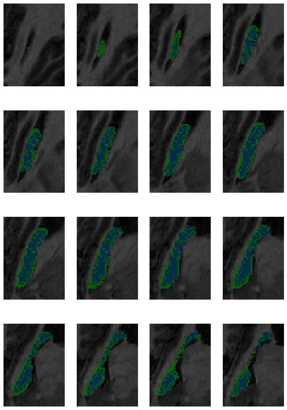
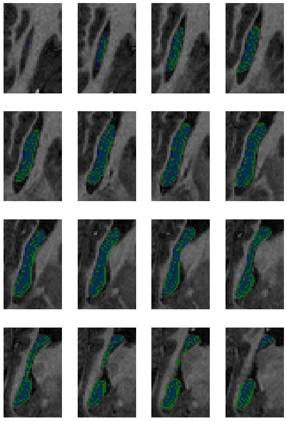

# Brain MRI Segmentation to Measure Hippocampal Volume

## Overview
The project uses the dataset that contains the segmentations of the right hippocampus train a U-Net segmentation model to measure the hippocampus volume.

## Setup & Run Model
```sh
# set up virtual environment
make env

# train and test model
make run

# test model using trained weights
make test
```

## Results Visualization
<center>

<br><i>Sample 104 & 316 (Green = Ground truth; Blue = Prediction)</i>
</center>

## Dataset
"Hippocampus" dataset from [Medical Decathlon competition](http://medicaldecathlon.com/). 
- A collection of NIFTI files, with one file per volume, and one file per corresponding segmentation mask.
- The original images here are T2 MRI scans of the full brain. In this dataset, the region around the hippocampus has been cropped out.

## Background
Alzheimer's disease (AD) is a progressive neurodegenerative disorder that results in impaired neuronal (brain cell) function and eventually, cell death. AD is the most common cause of dementia. Clinically, it is characterized by memory loss, inability to learn new material, loss of language function, and other manifestations. 

For patients exhibiting early symptoms, quantifying disease progression over time can help direct therapy and disease management. A radiological study via MRI exam is currently one of the most advanced methods to quantify the disease. In particular, the measurement of hippocampal volume has proven useful to diagnose and track progression in several brain disorders, most notably in AD. Studies have shown reduced volume of the hippocampus in patients with AD.

The hippocampus is a critical structure of the human brain (and the brain of other vertebrates) that plays important roles in the consolidation of information from short-term memory to long-term memory. In other words, the hippocampus is thought to be responsible for memory and learning. Humans have two hippocampi, one in each hemishpere of the brain. They are located in the medial temporal lobe of the brain. 

<center><br><i></i></center>

According to [studies](https://www.sciencedirect.com/science/article/pii/S2213158219302542), the volume of the hippocampus varies in a population, depending on various parameters, within certain boundaries, and it is possible to identify a "normal" range when taking into account age, sex and brain hemisphere. 

There is one problem with measuring the volume of the hippocampus using MRI scans: the process tends to be quite tedious since every slice of the 3D volume needs to be analyzed, and the shape of the structure needs to be traced. The fact that the hippocampus has a non-uniform shape only makes it more challenging.
